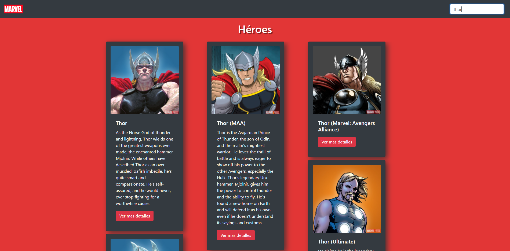

## This project was developed with React, using data from MARVEL'S API

https://developer.marvel.com/

## How to run it in your computer

First download this repository and run the commdan NPM INSTALL to get the modules needed  

Then run the command NPM START and it will open a tap in your browser in PORT 3000

This project was bootstrapped with [Create React App](https://github.com/facebook/create-react-app).

## A preview of the APP

